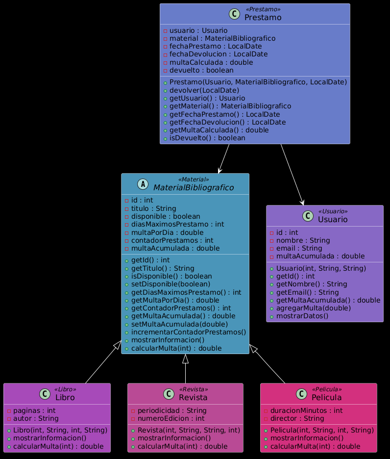

Biblioteca - Taller 3 Modelado de Software

Este proyecto es una aplicación de consola en Java para la gestión de materiales bibliográficos 
(libros, revistas y películas), préstamos y devoluciones, y cálculo de multas por retraso.

Características: 
1) Listar materiales: Muestra todos los materiales disponibles en la biblioteca.
2) Prestar material: Permite registrar un préstamo a un usuario.
3) Devolver material: Permite registrar la devolución y calcula la multa si hay retraso.
4) Mostrar multas de usuarios: Muestra el estado de multas de todos los usuarios.
5) Agregar material: Permite agregar nuevos libros, revistas o películas a la biblioteca.

Estructura de Clases: 
- MaterialBibliografico: Clase abstracta base para materiales.
- Libro, Revista, Pelicula: Clases específicas de materiales.
- Usuario: Representa a un usuario de la biblioteca.
- Prestamo: Gestiona los préstamos y devoluciones.

Diagrama de Clases
Puedes visualizar el diagrama de clases en el archivo: DiagramaDeClases.png

Cómo ejecutar: 
1) Abre el proyecto en Visual Studio Code.
2) Compila todos los archivos .java:
    - javac *.java
3) Ejecuta el programa principal
    - java Main

Uso: 
El menú principal permite seleccionar las opciones por número. Sigue las instrucciones en pantalla
para registrar usuarios, préstamos, devoluciones y agregar materiales.

Capturas de Ejecución:

Menú:

Ejemplo Material:

Prestar Material:

Devolver Material: 

Requisitos: 
- Java 8 o superior.
- Visual Studio Code (opcional).

Instalación:
Si no tienes Java instalado, descárgalo desde java.com.

Contribuciones:
Si deseas mejorar el proyecto, puedes enviar sugerencias o pull requests.

Autores:
- María del Mar Monsalve
- Nicolás Saldarriaga

Licencia:
Este proyecto es de uso académico. Puedes adaptarlo y compartirlo libremente.
